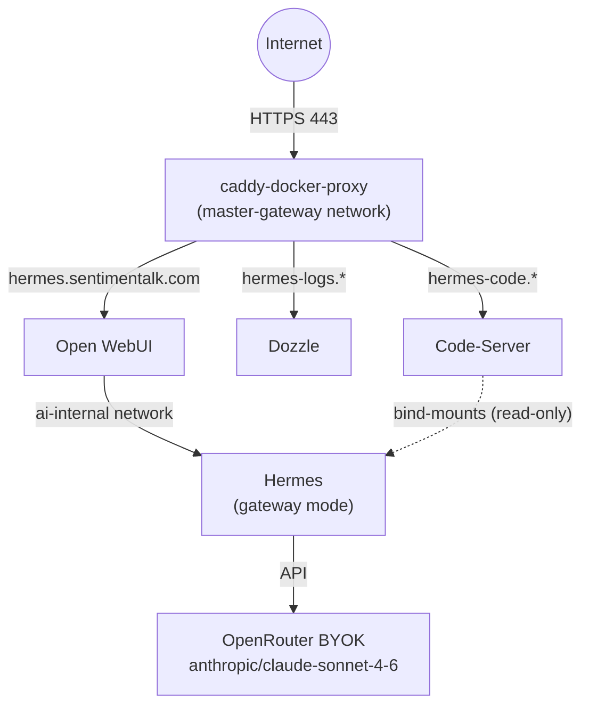

# Hermes Cloud Brain

> One brain, many mouths — all devices share the same Hermes instance.

Centralized AI agent deployment: Hermes runs as the sole backend, Open WebUI provides the chat interface, Caddy handles HTTPS routing, Dozzle shows live logs, and Code-Server enables remote maintenance.

## Architecture



## Quick Start

### Prerequisites

- Docker & Docker Compose v2+
- `master-gateway` Docker network (from your caddy-docker-proxy stack)
- DNS records pointing to your VPS:
  - `hermes.sentimentalk.com`
  - `hermes-logs.sentimentalk.com`
  - `hermes-code.sentimentalk.com`

### 1. Clone

```bash
git clone <this-repo> /data/hermes   # or wherever you want
cd /data/hermes
```

### 2. Create `.env`

Fill in all values. Key secrets to generate:

```bash
cp .env.example .env

# Hermes API key (used by Open WebUI to connect)
openssl rand -hex 32

# Open WebUI session secret
openssl rand -hex 16

# Caddy basic auth hash (for Dozzle & Code-Server)
docker run --rm caddy caddy hash-password --plaintext 'your-admin-password'
```

Hermes runtime settings live in `hermes-data/config.yaml` and are tracked in git. Secrets stay in `.env`; the default template uses OpenRouter with Anthropic BYOK routing. In OpenRouter, set the Anthropic BYOK integration to "Always use this key" so failed BYOK calls do not fall back to OpenRouter shared credits.

### 3. Start

```bash
docker compose up -d
```

### 4. First Login

1. Open `https://hermes.sentimentalk.com`
2. Sign up — **first user becomes admin**
3. Go to **Admin Panel → Settings → Connections**
4. Verify the Hermes endpoint shows as connected
5. Start chatting!

---

## Services

| Service | URL | Auth | Purpose |
|---------|-----|------|---------|
| Open WebUI | `hermes.sentimentalk.com` | WebUI login | Chat interface |
| Dozzle | `hermes-logs.sentimentalk.com` | Basic Auth | Live container logs |
| Code-Server | `hermes-code.sentimentalk.com` | Basic Auth + password | Maintenance IDE |
| Hermes | internal only | API key | AI brain (not publicly accessible) |

## Data Layout

```
./
├── docker-compose.yml
├── .env                    # secrets (git-ignored)
├── .env.example            # template
├── hermes-data/            # Hermes state (THE source of truth)
│   ├── config.yaml          # tracked runtime config
│   ├── SOUL.md              # generated/edited runtime identity
│   ├── .env                 # generated Hermes-specific secrets, if any
│   ├── memories/
│   ├── skills/
│   ├── sessions/
│   └── state.db            # READ-ONLY while Hermes is running
├── open-webui-data/        # Open WebUI database & uploads
├── dozzle-data/            # Dozzle filters & alerts
└── code-server/            # VS Code extensions & settings
```

## state.db Safety Rules

The `state.db` file is Hermes's memory. Corrupting it means losing your AI's entire history.

### Allowed

- View state.db via Code-Server SQLite extension (read-only)
- Query data for auditing
- Back up regularly

### Forbidden (while Hermes is running)

- `UPDATE` / `DELETE` / `INSERT` on state.db
- `VACUUM`
- Schema changes

### If You Must Edit state.db

```bash
# 1. Stop Hermes
docker stop hermes-brain

# 2. Backup
cp hermes-data/state.db hermes-data/state.db.backup-$(date +%Y%m%d-%H%M%S)

# 3. Edit with sqlite3
sqlite3 hermes-data/state.db

# 4. Verify integrity
sqlite3 hermes-data/state.db "PRAGMA integrity_check;"

# 5. Restart
docker start hermes-brain
```

## Logging

All containers use Docker's `json-file` driver with rotation:

| Container | Max Size | Max Files | Total Retained |
|-----------|----------|-----------|----------------|
| Hermes | 50 MB | 5 | 250 MB |
| Open WebUI | 50 MB | 5 | 250 MB |
| Dozzle | 10 MB | 3 | 30 MB |
| Code-Server | 10 MB | 3 | 30 MB |

**Dozzle** shows live logs in the browser. **json-file logs** persist on disk for post-crash forensics.

View logs manually:

```bash
# All containers
docker compose logs -f

# Just Hermes
docker compose logs -f hermes

# Raw log files on disk
ls /var/lib/docker/containers/<container-id>/*.log
```

## Backup

```bash
# Full backup
tar czf hermes-backup-$(date +%Y%m%d).tar.gz \
    hermes-data/ \
    open-webui-data/ \
    .env \
    docker-compose.yml

# Just Hermes state (most critical)
cp hermes-data/state.db hermes-data/state.db.backup-$(date +%Y%m%d-%H%M%S)
```

## Common Operations

```bash
# Restart just Hermes
docker compose restart hermes

# Update all images
docker compose pull
docker compose up -d

# View Hermes config
docker exec hermes-brain hermes config list

# Change Hermes model
# Edit hermes-data/config.yaml, then recreate Hermes:
docker compose up -d --force-recreate hermes
```

## Phase 3 — Future Expansion

To add new channels, just add services to `docker-compose.yml`:

### Telegram Bot (example)

```yaml
services:
  telegram-bot:
    image: your-telegram-bot-image
    container_name: hermes-telegram
    restart: unless-stopped
    environment:
      - TELEGRAM_BOT_TOKEN=${TELEGRAM_BOT_TOKEN}
      - HERMES_API_URL=http://hermes-brain:8642
      - HERMES_API_KEY=${HERMES_API_SERVER_KEY}
    networks:
      - ai-internal
```

### Hermes Native API (example)

```yaml
services:
  hermes-api:
    # Expose Hermes API publicly (with auth) for scripts
    # This is just a Caddy label addition — no new container needed
    # Add these labels to the hermes service:
    ...
    labels:
      caddy: hermes-api.sentimentalk.com
      caddy.reverse_proxy: "{{upstreams 8642}}"
      caddy.basicauth: "/* ${CADDY_ADMIN_USER} ${CADDY_ADMIN_HASH}"
    networks:
      - ai-internal
      - master-gateway    # add this network too
```

## Troubleshooting

| Symptom | Fix |
|---------|-----|
| Open WebUI can't find models | Check `HERMES_API_SERVER_KEY` matches in both services |
| Caddy not routing to services | Verify containers are on `master-gateway`: `docker network inspect master-gateway` |
| Hermes won't start | Check `docker compose logs hermes` and verify `.env` plus `hermes-data/config.yaml` |
| state.db locked | Another process has the DB open. Stop Code-Server SQLite extensions. |
| OpenRouter charges shared credits | Verify Anthropic BYOK is configured and set to "Always use this key"; `provider_routing.only` limits providers but OpenRouter key fallback is controlled in OpenRouter settings |
